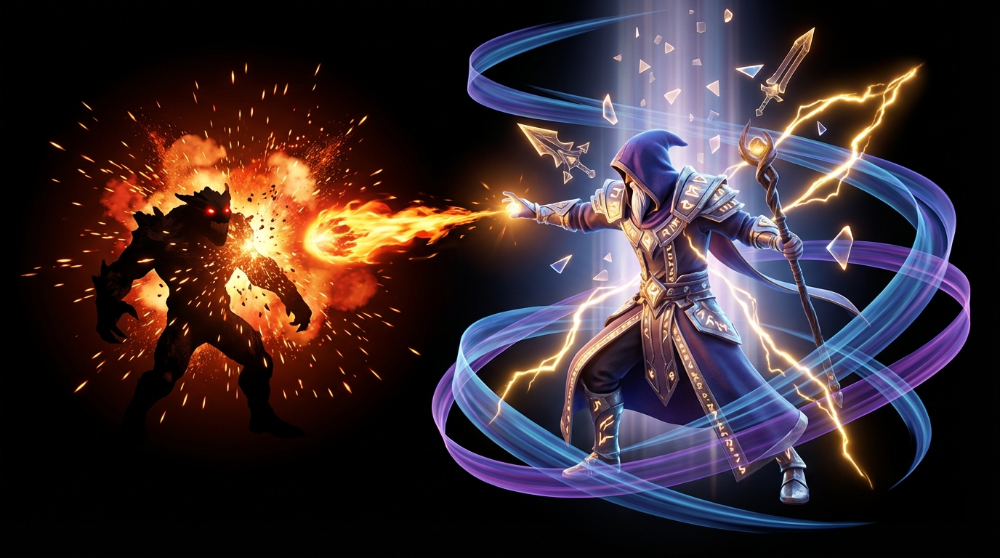

<p align="center">
  
</p>

<h1 align="center">Luminary</h1>
<p align="center"><strong>The Akashic VFX System for poqpoq World</strong></p>

<p align="center">
  <a href="#architecture"></a>
  <a href="#four-axis-vfx"></a>
  <a href="#integration"></a>
  <a href="docs/VFX_RESEARCH_AND_STRATEGY.md"></a>
  <a href="comms/comms.md"></a>
  <a href="LICENSE"></a>
</p>

---

Luminary transforms poqpoq's soul-level progression data into a living visual language. Every spell, combat event, social interaction, and act of creation is driven by the player's Akashic Record — their attributes, deity bonds, rank tier, and derived strengths. No two players look alike.

> *The Akashic Record is not just data. It's a visual signature.*

A fresh Emerald Noob and a Gold Transcendent cast the same spell — but the world *shows* the difference. A player bonded to Odin gets cobalt eye runes layered over their cool violet base. A charismatic leader's conversations shimmer with warm gold. A master crafter's completions burst with organic soul-colored sparks. These effects require no player action. They are simply what the soul looks like.

---

## Architecture

Luminary uses a **four-layer pipeline** with clear ownership boundaries:

```
Layer 4: EVENT SEQUENCES         → Rank up, deity bond, roll ceremony, social moments
Layer 3: SPELL/COMBAT ARCHETYPES → charge_spell, heal_pulse, inspire_pulse, craft_completion
Layer 2: AKASHIC PALETTE RESOLVER → Soul color, emissive, particle style, noise scale
Layer 1: VFX PRIMITIVE LIBRARY    → energy_orb, hex_rune, shockwave, ribbon_trail, etc.
```

### Key Design Principles

- **Palette-driven** — All visual decisions flow from the Akashic palette. No hardcoded colors.
- **Data-driven archetypes** — New spell shapes = JSON entry, no code changes.
- **Event-driven integration** — Luminary subscribes to `GameEventBus` events. Consuming teams emit events, never import Luminary directly.
- **Zero coupling** — Palette resolver has no Babylon.js dependency. Fully testable, server-safe.
- **Clean boundaries** — Luminary knows *how* to paint. Consuming teams decide *when*.

---

## Four-Axis VFX

poqpoq's Akashic system has four equal axes. Luminary serves all four — not just combat.

| Axis | Attributes | VFX Triggers | Visual Identity |
|------|-----------|-------------|-----------------|
| **Physical** | STR, AGI, END | Combat abilities, melee impacts, dodge trails | Ember sparks, heat shimmer, motion trails |
| **Mental** | MAG, WIS, CUN | Spell casting, puzzle solving, secret discovery | Geometric precision, crystalline shards, arcane runes |
| **Social** | LDR, FTH, CHA | Conversations, friendships, group questing, events, kindness | Warm shimmer, connecting ribbons, inspire pulses |
| **Creative** | CRE, ART, INN | Crafting, building, innovation, seed planting | Organic spirals, creation bursts, eureka flashes |

Social and Creative VFX are driven by **behavioral moments** — not button presses. The system watches for social interactions, acts of creation, and moments of kindness, then responds with effects that reflect who that player is at the soul level.

See [ADR-VFX-006](docs/ADR-VFX-006-Four-Axis-VFX-Vocabulary.md) for the full four-axis VFX vocabulary.

---

## Integration

Luminary integrates via the `GameEventBus` — consuming teams emit typed events, Luminary subscribes and renders.

| Event | Source | VFX Response |
|-------|--------|-------------|
| `combat:ability-fired` | ActionSlot | Spell archetype sequence |
| `npc:damaged` / `player:damaged` | ResourceManager | Impact flash, floating text |
| `akashic:rank-up` | AkashicRankManager | Rank ceremony, tier color burst |
| `akashic:data-loaded` | AkashicDataService | Palette computation + cache |
| `social:conversation` | Comms system | Ambient soul-color shimmer |
| `social:quest-together` | Quest system | Shared aura, blended soul colors |
| `creative:craft-complete` | Crafting system | Soul-colored spark spiral |
| `creative:build-placed` | Building system | Ground ring at placement point |

See [INTEGRATION.md](docs/INTEGRATION.md) for the complete wiring guide.

---

## Documentation

| Document | Purpose |
|----------|---------|
| [ADR-VFX-001](docs/ADR-VFX-001-Akashic-VFX-Authority.md) | Architecture decision — module topology & palette authority |
| [ADR-VFX-006](docs/ADR-VFX-006-Four-Axis-VFX-Vocabulary.md) | Four-axis VFX vocabulary — Social & Creative behavioral triggers |
| [VFX Research & Strategy](docs/VFX_RESEARCH_AND_STRATEGY.md) | Babylon.js deep dive, World repo analysis, implementation strategy |
| [Akashic System Reference](docs/AKASHIC_SYSTEM_COMPLETE_REFERENCE.md) | Full Akashic system — attributes, deities, ranks, combat stats |
| [VFX Strategy Overview](docs/poqpoq_akashic_vfx_strategy.md) | High-level VFX strategy with all 4 layers detailed |
| [Integration Guide](docs/INTEGRATION.md) | Drop-in wiring for World repo source files |
| [Team Comms](comms/comms.md) | Cross-team collaboration, open questions, decision log |

---

## Repository Structure

```
luminary/
├── comms/
│   └── comms.md                           # Cross-team collaboration
├── docs/
│   ├── ADR-VFX-001-*.md                   # Module topology ADR
│   ├── ADR-VFX-006-*.md                   # Four-axis VFX vocabulary
│   ├── VFX_RESEARCH_AND_STRATEGY.md       # Research & strategy report
│   ├── AKASHIC_SYSTEM_COMPLETE_REFERENCE.md
│   ├── poqpoq_akashic_vfx_strategy.md
│   ├── INTEGRATION.md
│   ├── AkashicVFXTypes.ts                 # Shared type contracts (no Babylon dep)
│   ├── AkashicPaletteResolver.ts          # Pure palette resolver
│   ├── AkashicVFXSystem.ts                # Babylon.js VFX service
│   ├── AkashicVFXSystem.test.ts           # Unit tests (14 tests, no Babylon needed)
│   └── spell_archetypes.json              # Data-driven archetype definitions
├── images/
│   └── ...
├── LICENSE                                # MIT
└── README.md
```

---

## Related Projects

| Project | Role |
|---------|------|
| [poqpoq World](https://github.com/increasinglyHuman/poqpoq-world) | Game engine — primary consumer |
| Scripter | Scripting engine — script-triggered VFX |
| Glitch | Preview & visualization tool |
| Dungeon Master | Dungeon effects, traps, boss encounters |

---

## Contributing

See [comms/comms.md](comms/comms.md) for the team collaboration document, open questions, and integration status.

## License

MIT License — see [LICENSE](LICENSE).

---

<p align="center">
  <em>poqpoq World · Luminary VFX System · 2026</em><br/>
  <em>Technical Lead: Allen Partridge · <a href="https://github.com/increasinglyHuman">increasinglyHuman</a></em>
</p>
